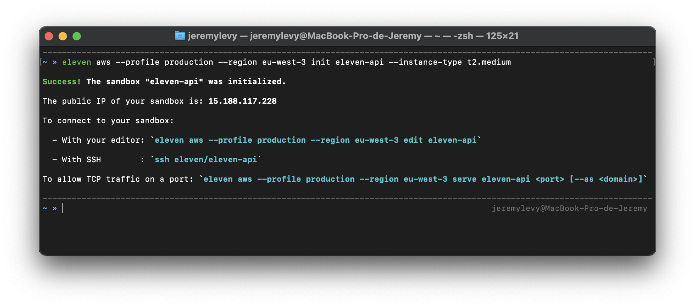

<p align="center">
  
</p>

<p align="center">
    <h1 align="center">AWS Cloud Provider</h1>
    <p align="center">This repository contains the source code that implements the AWS cloud provider for the <a href="https://github.com/eleven-sh/cli">Eleven CLI</a>.</p>
</p>

```bash
eleven aws --profile production --region eu-west-3 init eleven-api --instance-type t2.medium
```
<p align="center">
  
</p>

## Table of contents
- [Usage](#usage)
    - [Authentication](#authentication)
        - [--profile](#--profile)
        - [--region](#--region-and-aws_region)
    - [Permissions](#permissions)
    - [Authorized instance types](#authorized-instance-types)
- [Infrastructure components](#infrastructure-components)
    - [Init](#init)
    - [Edit](#edit)
    - [Serve](#serve)
    - [Unserve](#unserve)
    - [Remove](#remove)
    - [Uninstall](#uninstall)
- [Infrastructure costs](#infrastructure-costs)
- [License](#license)

## Usage

```console
To begin, create your first sandbox using the command:
	
  eleven aws init <sandbox_name>
	
Once created, you may want to connect your editor to it using the command: 
	
  eleven aws edit <sandbox_name>
	
If you don't plan to use this sandbox again, you could remove it using the command:
		
  eleven aws remove <sandbox_name>

Usage:
  eleven aws [command]

Examples:
  eleven aws init eleven-api --instance-type m4.large 
  eleven aws edit eleven-api
  eleven aws remove eleven-api

Available Commands:
  edit        Connect your editor to a sandbox
  init        Initialize a sandbox
  remove      Remove a sandbox
  serve       Allow TCP traffic on a port
  uninstall   Uninstall Eleven
  unserve     Disallow TCP traffic on a port

Flags:
  -h, --help             help for aws
      --profile string   the configuration profile to use to access your AWS account
      --region string    the region to use to access your AWS account

Use "eleven aws [command] --help" for more information about a command.
```

### Authentication

In order to access your AWS account, the Eleven CLI will first look for credentials in the following environment variables:

- `AWS_ACCESS_KEY_ID`

- `AWS_SECRET_ACCESS_KEY`

If not found, the configuration files created by the AWS CLI (via `aws configure`) will be used.

#### --profile

If you have configured the AWS CLI with multiple configuration profiles, you could tell Eleven which one to use via the `--profile` flag:

```shell
eleven aws --profile production init eleven-api
```

**By default, Eleven will use the profile named `default`.**

#### --region and AWS_REGION

If you want to overwrite the region resolved by the Eleven CLI, you could use the `--region` flag:

```shell
eleven aws --region eu-west-3 init eleven-api
```

```shell
eleven aws --profile production --region eu-west-3 init eleven-api
```

or the `AWS_REGION` environment variable:

```shell
export AWS_REGION=eu-west-3
```

**The `--region` flag takes precedence over the `AWS_REGION` environment variable.**

### Permissions

Your credentials must have certain permissions attached to be used with Eleven. See the next sections to learn more about the actions that will be done on your behalf.

### Authorized instance types

To be used with Eleven, the chosen instance must be **an on-demand linux instance (with EBS support) running on an amd64 or arm64 architecture**.

#### Examples

```shell
t2.medium, m6g.large, a1.xlarge, c5.12xlarge...
```

## Infrastructure components


The schema above describe all the components that may be created in your AWS account. The next sections will describe their lifetime according to your use of the Eleven CLI.

### Init

```bash
eleven aws init eleven-api
eleven aws init eleven-api --instance-type t2.medium
```

#### The first time Eleven is used in a region

When running the `init` command for the first time in a region, a DynamoDB table named `eleven-config-dynamodb-table` will be created. This table will be used to store the state of the infrastructure.

Once created, all the following components will also be created:

- A `VPC` named `eleven-vpc` with an IPv4 CIDR block equals to `10.0.0.0/16` to isolate your infrastructure.

- A `public subnet` named `eleven-public-subnet` with an IPv4 CIDR block equals to `10.0.0.0/24` that will contain the instances running your sandboxes.

- An `internet gateway` named `eleven-internet-gateway` to let the instances communicate with internet.

- A `route table` named `eleven-route-table` that will allow egress traffic from the instances to the internet (via the internet gateway).

#### On each init

Each time the `init` command is run for a new sandbox, the following components will be created:

- An `EC2 instance` named `eleven-${SANDBOX_NAME}-instance` with a type equals to the one passed via the `--instance-type` flag **or `t2.medium` by default**.

- A `network interface` named `eleven-${SANDBOX_NAME}-network-interface` to enable network connectivity in the instance.

- An `Elastic IP` named `eleven-${SANDBOX_NAME}-elastic-ip` to let you access the instance via a fixed public IP.

- A `security group` named `eleven-${SANDBOX_NAME}-security-group` to let the instance accepts `TCP` connections on served ports.

- An `SSH key pair` named `eleven-${SANDBOX_NAME}-key-pair` to let you access the instance via `SSH`.
    
- An `EBS volume` attached to the instance (default to `16GB`) to provide long-term storage.

### Edit

```bash
eleven aws edit eleven-api
```

When running the `edit` command, nothing will be done to your infrastructure.

### Serve

```bash
eleven aws serve eleven-api 8080
eleven aws serve eleven-api 8080 --as api.eleven.sh
```

When running the `serve` command without the `--as` flag, an `ingress` rule will be added to the `security group` of the instance running your sandbox. 

This rule will allow all `TCP` trafic from `any IP address` to the specified port.

**When the `--as` flag is used, nothing is done to your infrastructure**.

### Unserve

```bash
eleven aws unserve eleven-api 8080
```

When running the `unserve` command, the `ingress` rule added by the `serve` command will be removed.

### Remove

```bash
eleven aws remove eleven-api
```

When running the `remove` command, all the components associated with the sandbox will be removed.

In other words:

- The `EC2 instance`.

- The `network interface`.

- The `Elastic IP`.

- The `security group`.

- The `SSH key pair`.

- The `EBS volume`.

### Uninstall

```bash
eleven aws uninstall
```

When running the `uninstall` command, all the components shared by your sandboxes **in the resolved region** will be removed. 

In other words:

- The `route table`.

- The `internet gateway`.

- The `public subnet`.

- The `VPC`.

- The `DynamoDB table`.

## Infrastructure costs

The cost of running a sandbox on AWS is essentially equal to the cost of the `EC2` instance and the `EBS` volume:

- For the `EC2` instance, the price depends on the instance type chosen.

- For the `EBS` volume, Eleven uses the `General Purpose SSD (gp2)` type that will cost you ~$0.10 per GB-month.

All other components are free (or mostly free) given their limited usage.

## License

Eleven is available as open source under the terms of the [MIT License](http://opensource.org/licenses/MIT).
